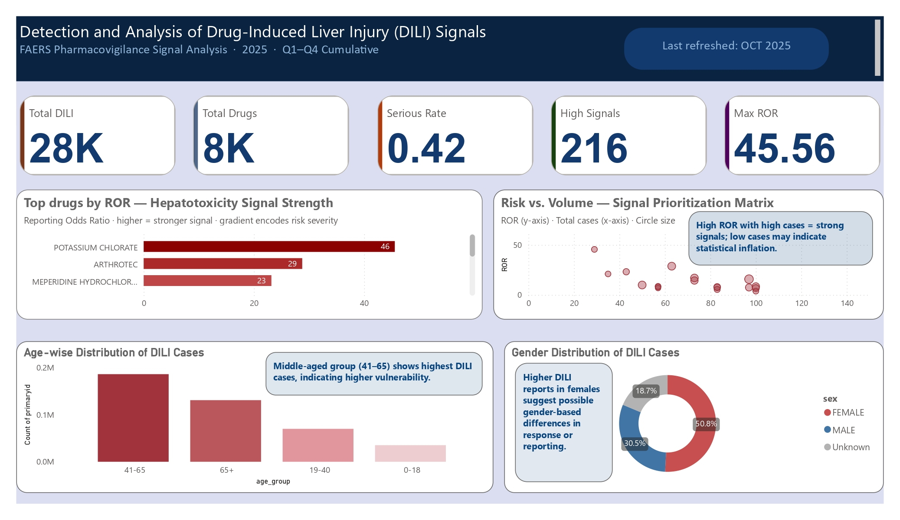

#  Detection of Drug-Induced Liver Injury (DILI) Safety Signals

##  Project Overview
This project analyzes real-world adverse event data from the FDA Adverse Event Reporting System (FAERS) to detect potential Drug-Induced Liver Injury (DILI) signals using statistical signal detection techniques.

The goal is to identify **high-risk drugs and affected populations** using data-driven methods, supporting pharmacovigilance decision-making.

---

##  Objective
- Detect potential DILI safety signals using FAERS data  
- Apply disproportionality analysis (Reporting Odds Ratio - ROR)  
- Identify high-risk drugs  
- Analyze demographic patterns (age, gender, seriousness)  

---

##  Data Source
- **FAERS (FDA Adverse Event Reporting System)**
- Tables used:
  - DEMO (Patient demographics)
  - DRUG (Drug exposure)
  - REAC (Adverse reactions)
  - OUTC (Clinical outcomes)

---

##  Data Processing
- Removed duplicate case versions (kept latest per case)
- Filtered **Primary (PS) and Secondary (SS) suspect drugs**
- Merged datasets using `primaryid`
- Removed duplicate drug-case combinations
- Created DILI flag using MedDRA terms

---

##  Methodology: Signal Detection

### Reporting Odds Ratio (ROR)

ROR is used to detect disproportionate reporting of adverse events.

\[
ROR = (a/c) ÷ (b/d)
\]

Where:
- a = DILI cases for drug  
- b = non-DILI cases  
- c, d = other drugs  

 **ROR > 1 indicates a potential safety signal**

To improve reliability:
- ROR was analyzed alongside **case counts**
- High ROR + low cases → interpreted cautiously

---

##  Dashboard Insights

---

##  Key Findings

- ~28,000 DILI cases identified  
- ~8,000 drugs analyzed  
- **216 drugs showed potential safety signals (ROR > 1)**  

###  High-Signal Drugs
- Potassium Chlorate  
- Arthrotec  
- Meperidine Hydrochloride  

###  Signal Interpretation
- High ROR + high case count → **strong signals**  
- High ROR + low case count → **possible statistical inflation**  

###  Demographic Insights
- Highest reporting in **41–65 age group**  
- Higher reporting observed in **females**  

###  Clinical Impact
- ~42% of cases classified as **serious**  
  (e.g., hospitalization, life-threatening, death)

---

##  Key Insight
This analysis highlights how combining **statistical signal strength (ROR)** with **reporting volume** enables better prioritization of drug safety risks.

---

##  Limitations
- FAERS is a spontaneous reporting system  
- Subject to reporting bias and underreporting  
- Cannot establish causality  
- Requires further clinical validation  

---

##  Tech Stack
- Python (Pandas, NumPy)
- Data Cleaning & Feature Engineering
- Power BI (Dashboard & Visualization)
- Statistical Analysis (ROR)

---

##  Business Impact
- Helps pharmacovigilance teams **prioritize high-risk drugs**
- Supports **early signal detection**
- Enables **data-driven safety monitoring**

---

##  Presentation
[Download PPT](presentation/dili_presentation.pptx)

---

##  Conclusion
This project demonstrates how real-world healthcare data can be used to detect potential safety signals and support decision-making in pharmacovigilance.

---

##  Author
Vaishnavi Kumari
